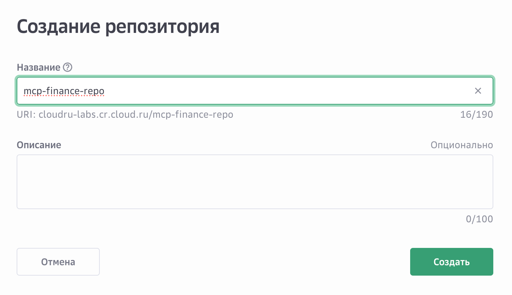
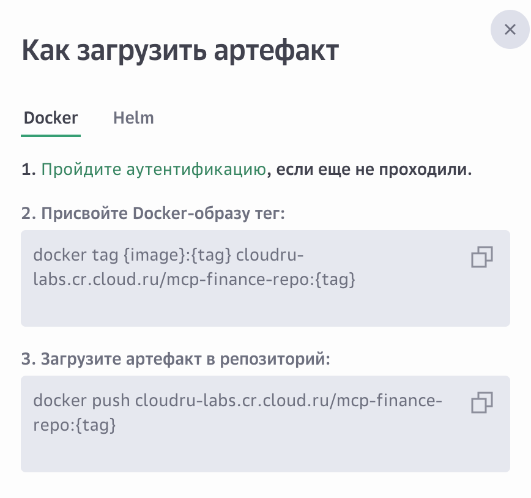
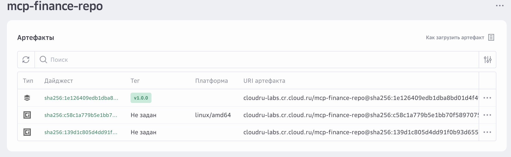
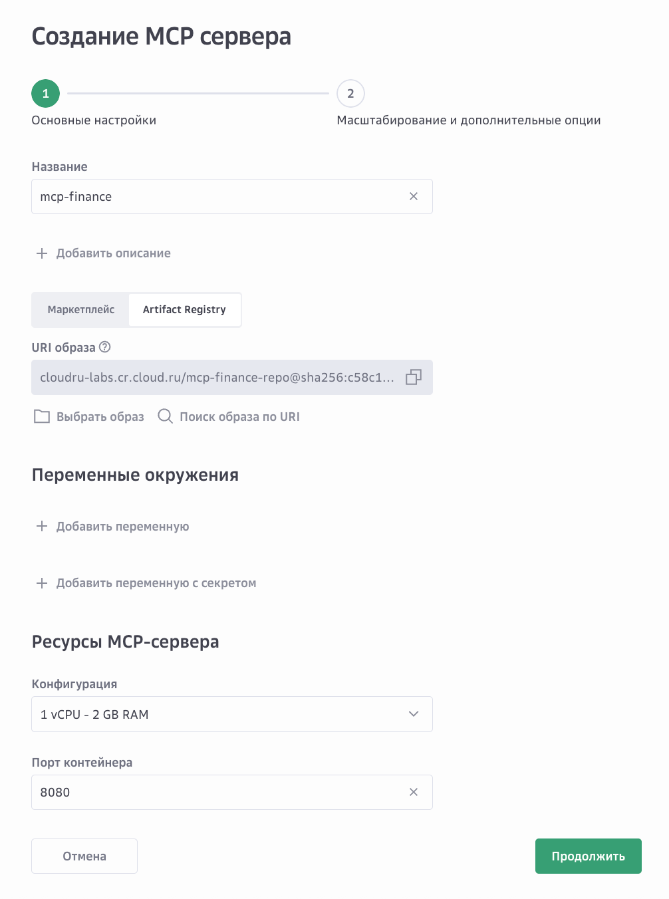
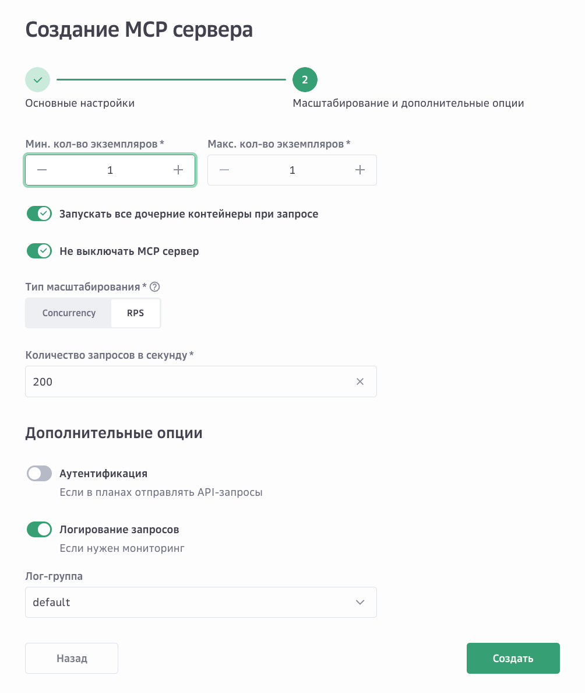
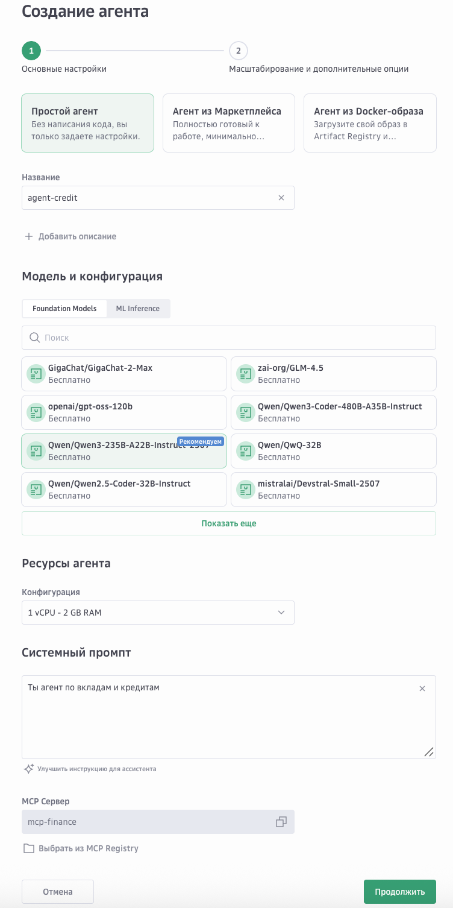
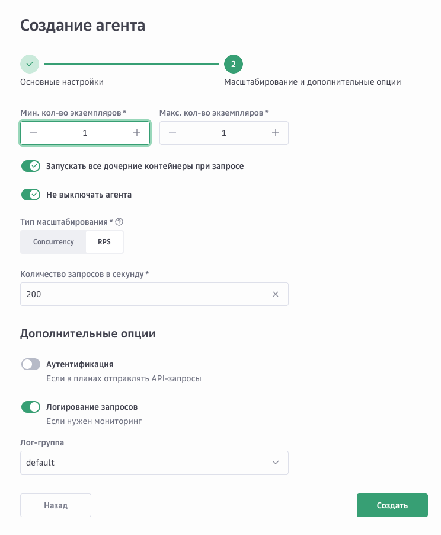
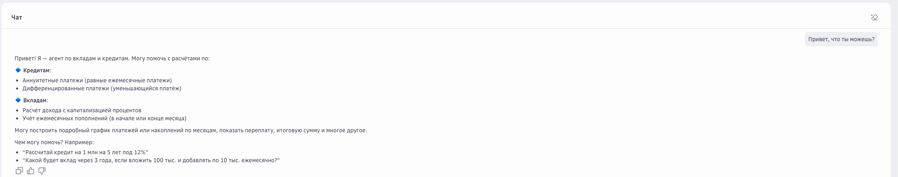
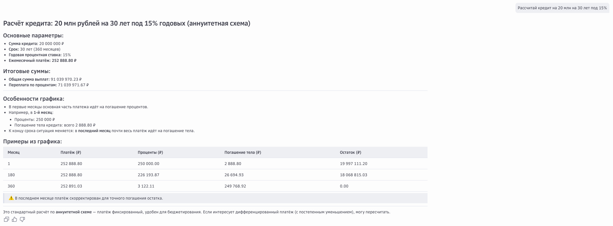
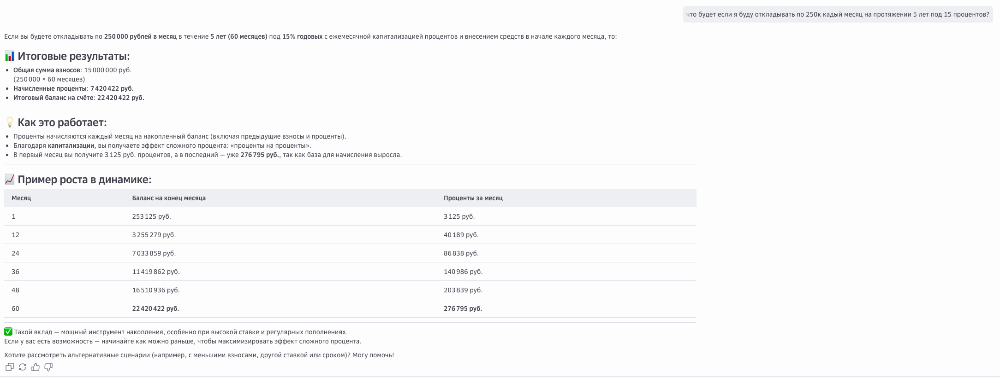

# Инструкция по запуску MCP-сервера в ai-agents

---

## Как написать MCP-сервер?

Мы разберем как написать MCP-сервер расчета кредитов, вкладов и инвестиций.

Все файлы кроме ```src/server.py``` отвечают за реализацию тулов, которая в вашем случае будет отличаться, поэтому сфокусируемся на 
```src/server.py```. 

### 1. Что такое MCP-сервер

MCP-сервер — это сервис, предоставляющий набор инструментов (tools), к которым может обращаться агент. Каждый инструмент — это функция Python, зарегистрированная в фреймворке **FastMCP**.

FastMCP берёт на себя:

* запуск сервера (streamable-http),
* регистрацию и описание инструментов,
* сериализацию/десериализацию аргументов и результатов,
* автоматическую генерацию спецификаций для клиента,
* поддержку метрик Prometheus,
* интеграцию с OpenTelemetry для трейсинга.

### 2. Базовая структура

MCP-сервер обычно состоит из:

* **основного файла** (`server.py`), где создаётся экземпляр `FastMCP`, подключаются инструменты и запускается сервер,
* **единого экземпляра FastMCP** (`mcp_instance.py`) для использования во всех модулях,
* **метрик** (`metrics.py`) для мониторинга через Prometheus,
* **описаний инструментов** через декоратор `@mcp.tool`.
* **модулей с бизнес-логикой** (например, расчёты, валидации),

Пример создания сервера:

```python
from mcp_instance import mcp

if __name__ == "__main__":
    mcp.run(
        transport="streamable-http",  # транспорт (streamable-http или sse)
        host="0.0.0.0",               # адрес
        port=os.getenv("PORT", 8000)  # порт по умолчанию 8000
    )
```

После запуска сервер слушает входящие запросы и выполняет зарегистрированные инструменты.

### 3. Регистрация инструментов

Инструменты определяются как async функции Python, аннотированные декоратором `@mcp.tool`.

```python
@mcp.tool
async def loan_schedule_annuity(principal: float, annual_rate_percent: float, months: int, ctx: Context = None) -> dict:
    """Полное и достаточное описание инструмента"""
    if ctx:
        await ctx.info("Начинаем расчет...")
        await ctx.report_progress(progress=0, total=100)
    # валидации и расчёты
    if ctx:
        await ctx.report_progress(progress=100, total=100)
    return {"summary": {...}, "schedule": [...]}
```

FastMCP автоматически:

* создаёт описание инструмента (имя, аргументы, возвращаемый тип) из аннотаций и docstring,
* добавляет его в спецификацию сервера,
* обрабатывает вызовы с аргументами.

### 4. Как правильно писать описания MCP-тулов

Чтобы инструменты были понятны и клиенту, и агенту, рекомендуется придерживаться следующих правил:

1. **Docstring обязателен**
   Первые 1–2 строки — краткое назначение инструмента. Далее — подробное описание формата входных и выходных данных.

2. **Описание аргументов**
   Используй секцию `Args:`. Укажи тип, допустимый диапазон и смысл каждого параметра.

   Пример:

   ```python
   Args:
       principal (float): Сумма кредита (> 0, ≤ лимита).
       annual_rate_percent (float): Годовая ставка в процентах.
       months (int): Срок в месяцах.
       ctx (Context): Контекст для логирования и прогресс-отчетов (опционально).
   ```

3. **Описание возвращаемых данных**
   Указывай структуру словаря, ключи и что они означают.
   Используй `Returns:` → `Dict[str, Any]`.

4. **Описание исключений**
   Важно явно документировать, при каких условиях поднимается `ValueError` (например, неверные диапазоны).

5. **Дополнительные примечания**
   Если есть округления, коррекции или ограничения, указывай их в `Note:`.

### 5. Рекомендации по стилю

* Один `FastMCP` на весь сервис (через `mcp_instance.py`).
* Логику расчётов выноси в отдельные модули (а в туле только валидация + вызов).
* Docstring должен быть **самодостаточным** — чтобы агент мог понять инструмент только по описанию.
* Используй строгие аннотации типов (`float`, `int`, `bool`) → FastMCP будет валидировать входные данные автоматически.
* Используй `Context` для логирования и прогресс-отчетов в длительных операциях.
* Добавляй метрики для отслеживания использования инструментов.

## Доступные инструменты

### 1. Аннуитетный кредит (`loan_schedule_annuity`)

Расчет фиксированного ежемесячного платежа и помесячного графика по аннуитетной схеме.

**Параметры:**
- `principal` (float): Сумма кредита
- `annual_rate_percent` (float): Годовая ставка в процентах
- `months` (int): Срок в месяцах

**Возвращает:** График платежей с помесячной разбивкой и итоговой сводкой.

### 2. Дифференцированный кредит (`loan_schedule_differential`)

Расчет платежей с постоянной частью тела и уменьшающимися процентами.

**Параметры:**
- `principal` (float): Сумма кредита
- `annual_rate_percent` (float): Годовая ставка в процентах
- `months` (int): Срок в месяцах

**Возвращает:** График платежей с помесячной разбивкой и итоговой сводкой.

### 3. Вклад с капитализацией (`deposit_schedule_compound`)

Расчет графика вклада с ежемесячной капитализацией и взносами.

**Параметры:**
- `initial_amount` (float): Начальная сумма
- `annual_rate_percent` (float): Годовая ставка в процентах
- `months` (int): Срок в месяцах
- `monthly_contribution` (float): Ежемесячный взнос
- `contribution_at_beginning` (bool): Взнос в начале месяца (True) или в конце (False)

**Возвращает:** График роста вклада с помесячной разбивкой и итоговой сводкой.

### 4. Сравнение кредитов (`compare_loan_schedules`) 🆕

Сравнение аннуитетного и дифференцированного кредитов с одинаковыми параметрами.

**Параметры:**
- `principal` (float): Сумма кредита
- `annual_rate_percent` (float): Годовая ставка в процентах
- `months` (int): Срок в месяцах

**Возвращает:** 
- Сравнение по общей сумме выплат, переплате и разнице в платежах
- Преимущества каждого типа кредита
- Рекомендацию по выбору типа кредита

### 5. Калькулятор инвестиций (`investment_calculator`) 🆕

Расчет роста инвестиций с регулярными взносами и капитализацией процентов.

**Параметры:**
- `initial_amount` (float): Начальная сумма инвестиций
- `annual_rate_percent` (float): Годовая доходность в процентах
- `months` (int): Срок инвестирования в месяцах
- `monthly_contribution` (float): Ежемесячный взнос
- `contribution_at_beginning` (bool): Взнос в начале месяца (True) или в конце (False)

**Возвращает:**
- График роста инвестиций с помесячной разбивкой
- Метрики роста: ROI, средняя годовая доходность, прирост капитала
- Итоговую сумму и общие взносы

## Метрики и мониторинг

Сервер предоставляет следующие endpoints:

- **MCP Server**: `http://localhost:8000/mcp` - основной endpoint для MCP протокола
- **Метрики Prometheus**: `http://localhost:8000/metrics` - метрики использования инструментов
- **Health Check**: `http://localhost:8000/health` - проверка состояния сервера

### Доступные метрики:

- `tool_calls_total` - общее количество вызовов инструментов (по инструменту и статусу)
- `calculation_errors_total` - количество ошибок расчетов (по инструменту и типу ошибки)

## OpenTelemetry трейсинг

Сервер поддерживает интеграцию с OpenTelemetry для трейсинга операций. Для включения трейсинга задайте переменные окружения:

- `OTEL_ENDPOINT` - endpoint для отправки трейсов (например, `http://jaeger:4318/v1/traces`)
- `OTEL_SERVICE_NAME` - имя сервиса для OpenTelemetry (по умолчанию `mcp-finance-server`)

Если `OTEL_ENDPOINT` не задан, трейсы будут выводиться в консоль для локальной разработки.

## Переменные окружения

Создайте файл `.env` на основе `.env.example`:

```bash
cp .env.example .env
```

Основные переменные:

- `PORT` - порт сервера (по умолчанию 8000)
- `LOG_LEVEL` - уровень логирования (INFO, DEBUG, WARNING, ERROR)
- `MAX_PRINCIPAL` - максимальная сумма кредита/вклада (по умолчанию 1 млрд)
- `MAX_CONTRIBUTION` - максимальный ежемесячный взнос (по умолчанию 100 млн)
- `MAX_MONTHS` - максимальный срок в месяцах (по умолчанию 600)
- `MAX_RATE` - максимальная процентная ставка (по умолчанию 200%)
- `MAX_BALANCE_CAP` - максимальный баланс для защиты от переполнения (по умолчанию 1 трлн)
- `OTEL_ENDPOINT` - endpoint для OpenTelemetry (опционально)
- `OTEL_SERVICE_NAME` - имя сервиса для OpenTelemetry (опционально)

## Локальный запуск

1. Установите зависимости (рекомендуется `uv`):

```bash
uv sync
```

2. Создайте файл `.env` с переменными окружения:

```bash
cp .env.example .env
# Отредактируйте .env файл при необходимости
```

3. Запустите сервер:

```bash
uv run python src/server.py
```

Сервер будет доступен на:
- **MCP Server**: `http://localhost:8000/mcp` (streamable-http транспорт)
- **Метрики**: `http://localhost:8000/metrics`
- **Health Check**: `http://localhost:8000/health`

## Docker

Сборка и запуск контейнера:

```bash
docker buildx build --platform linux/amd64 -t mcp-finance .
docker run --rm -p 8000:8000 \
  -e PORT=8000 \
  mcp-finance
```

## Запуск mcp сервера в AI agents

### Важный момент.

MCP сервер в AI agents не должен использовать файловую систему в рантайме. Все манипуляции с ней необходимо делать на этапе сборки docker-образа**

#### Предварительно нужно:
1. Создать реестр в сервисе Artifact Registry.


2. Создать репозиторий в котором будем хранить наш mcp сервер



3. Загрузить docker образ по инструкции



3.0 Пройти аутентификацию по инструкции https://cloud.ru/docs/artifact-registry-evolution/ug/topics/quickstart

3.1 Собрать докер образ
```shell
docker buildx build --platform linux/amd64 -t mcp-finance .
```

3.2 Присвойте Docker-образу тег
```shell
docker tag mcp-finance:latest cloudru-labs.cr.cloud.ru/mcp-finance-repo:v1.0.0
```

3.3 Загрузите артефакт в репозиторий
```shell
docker push cloudru-labs.cr.cloud.ru/mcp-finance-repo:v1.0.0
```



4. Создаем mcp сервер через UI cloud.ru





Успешно созданный mcp сервер:


5. Создаем агента с нашими MCP тулами. MCP сервер нужно выбрать в соответствующем поле.




6. Общаемся с агентом.





## Структура проекта

```
lab1-mcp-finance-lab/
├── src/
│   ├── mcp_instance.py      # Единый экземпляр FastMCP
│   ├── metrics.py            # Prometheus метрики
│   ├── server.py             # Основной файл сервера
│   ├── calculations.py       # Реализация алгоритмов расчетов
│   ├── validators.py         # Валидация входных данных
│   ├── utils.py              # Вспомогательные функции
│   └── config.py             # Конфигурационные параметры
├── Dockerfile                # Определение Docker-образа
├── pyproject.toml            # Зависимости проекта
├── .env.example              # Примеры переменных окружения
└── README.md                 # Этот файл
```

## Технологии

- Python 3.12+
- FastMCP >= 2.10.0 - фреймворк для MCP серверов
- Prometheus Client - метрики
- OpenTelemetry - трейсинг
- uv - менеджер зависимостей
- Docker - контейнеризация
