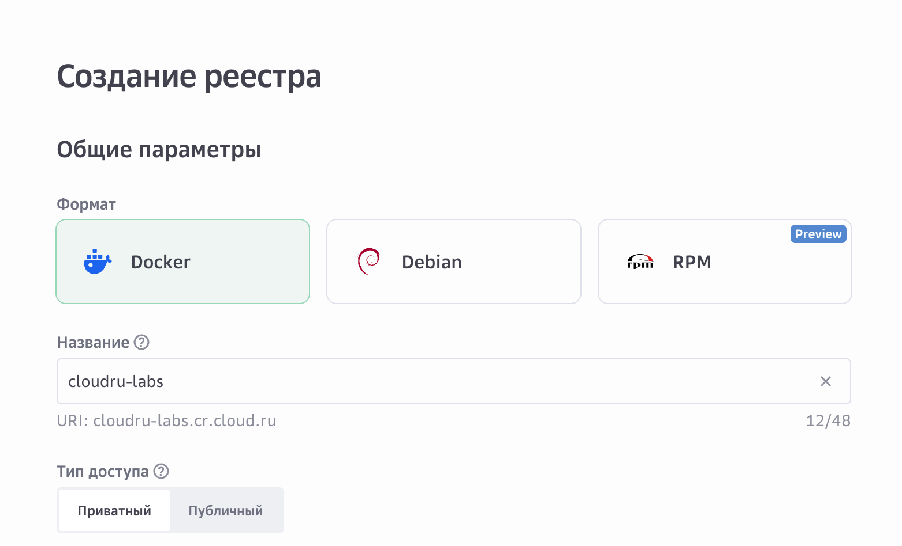
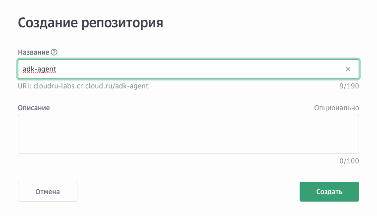
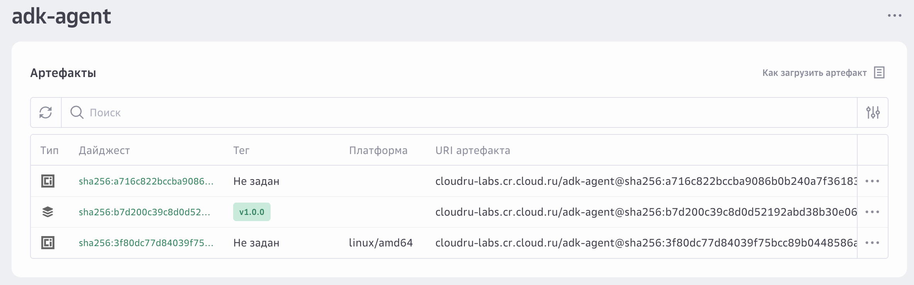
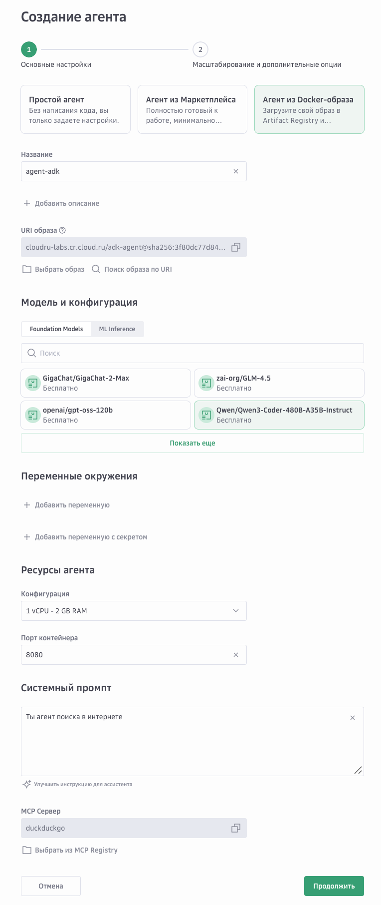
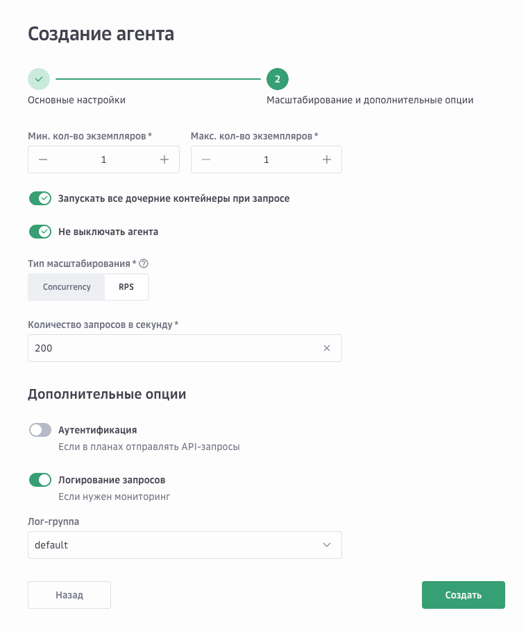
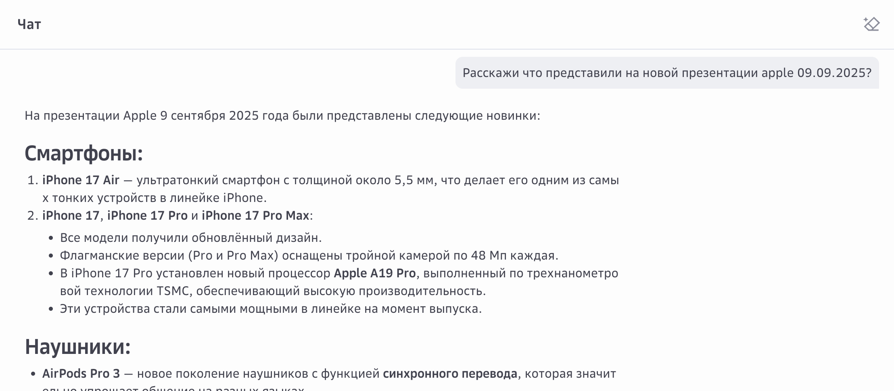

# Запуск агента из Docker-образа в AI Agents (Google ADK)

Этот гайд описывает пошаговый процесс упаковки и запуска собственного агента в платформе **AI Agents** с использованием **Docker** и **google-adk**.

---

## Важные моменты

### 1. Не используйте файловую систему в рантайме
Агенты в AI Agents **не должны работать с файловой системой** во время выполнения.  
Все необходимые файлы и зависимости нужно упаковывать на этапе сборки Docker-образа.

### 2. Переменные окружения
AI Agents автоматически прокидывает готовые переменные окружения в контейнер. Вам не нужно заботиться об их настройке вручную.

| Переменная                             | Описание                                                                                                                                                           |
|----------------------------------------|--------------------------------------------------------------------------------------------------------------------------------------------------------------------|
| `PHOENIX_ENDPOINT`                     | Уже созданный в кластере Arizr Phoenix вида https://{domain}/v1/traces. Нужно для просмотра тейсов агента.                                                         |
| `ENABLE_PHOENIX`                       | По умолчанию = `True`                                                                                                                                              |
| `AGENT_NAME`                           | Название агента (UI). Нужно для карточки агента a2a                                                                                                                |
| `AGENT_DESCRIPTION`                    | Описание агента (UI). Нужно для карточки агента a2a                                                                                                                |
| `AGENT_VERSION`                        | Версия (по умолчанию `v1.0.0`). Нужно для карточки агента a2a                                                                                                      |
| `EVOLUTION_SERVICE_ACCOUNT_KEY_ID`     | `key_id` сервисного аккаунта для доступа к Evolution. Нужно для доступа к LLM в ML Inference                                                                       |
| `EVOLUTION_SERVICE_ACCOUNT_KEY_SECRET` | `key_secret` сервисного аккаунта для доступа к Evolution. Нужно для доступа к LLM в ML Inference                                                                   |
| `LLM_MODEL`                            | Название модели с перфиксом hosted_vllm (например `hosted_vllm/Qwen/Qwen3-Coder-480B-A35B-Instruct`), Нужно для доступа к LLM в Foundation Models или ML Inference |
| `LLM_API_BASE`                         | `https://foundation-models.api.cloud.ru/v1` Нужно для доступа к LLM в Foundation Models                                                                            |
| `LLM_API_KEY`                          | API-ключ для доступа к Foundation Models                                                                                                                           |
| `AGENT_SYSTEM_PROMPT`                  | Системный промпт агента                                                                                                                                            |
| `URL_AGENT`                            | URL вида `https://{{.AgentID}}-agent.ai-agent.inference.cloud.ru`                                                                                                  |
| `PORT`                                 | Порт на котором будет работать агент                                                                                                                               |
| `MCP_URL`                              | Список URL MCP-серверов разделенных запятой. Вида `http://example.com/sse` или `http://example1.com/sse,http://example2.com/sse`                                   |   

---

## Пошаговый гайд

### Шаг 1. Создаём реестр в **Artifact Registry**
Откройте UI cloud.ru и создайте новый реестр.



---

### Шаг 2. Создаём репозиторий
Создайте репозиторий для хранения Docker-образа вашего агента.



---

### Шаг 3. Загружаем Docker-образ

#### 3.0 Аутентификация
Пройдите аутентификацию в Artifact Registry:  
[Инструкция cloud.ru](https://cloud.ru/docs/artifact-registry-evolution/ug/topics/quickstart)

#### 3.1 Сборка образа
```bash
docker buildx build --platform linux/amd64 -t adk-agent .
````

#### 3.2 Присваиваем тег

```bash
docker tag adk-agent:latest cloudru-labs.cr.cloud.ru/adk-agent:v1.0.0
```

#### 3.3 Публикуем образ

```bash
docker push cloudru-labs.cr.cloud.ru/adk-agent:v1.0.0
```

После успешной загрузки образ будет доступен в реестре.



---

### Шаг 4. Создаём агента в UI cloud.ru

1. Задайте название агента.
2. Укажите Docker-образ, загруженный ранее.
3. Введите системный промпт.
4. Выберите MCP-сервер с нужными инструментами.




---

### Шаг 5. Используем агента

После создания вы можете общаться с агентом напрямую через UI чата.



---

## Резюме

* Все данные готовим на этапе сборки Docker-образа.
* Основные переменные окружения задаются платформой автоматически.
* Основной процесс: **собираем → тегируем → пушим → создаём агента через UI → общаемся**.

```
